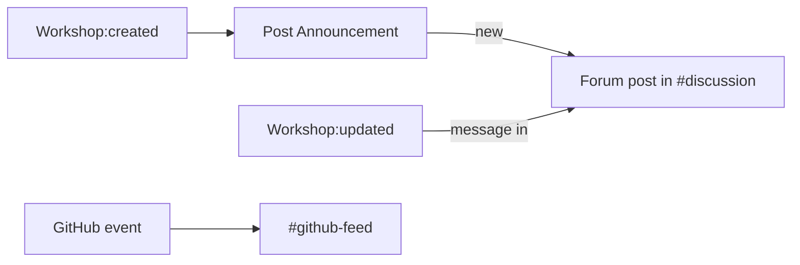

# server events

The configuration for all workshop events for the Discord server.

## Configuration

```mermaid
graph LR;
    Workshop:created-->B[Post Announcement]-->|new| C[Forum post in #discussion];
    Workshop:updated-->|message in| C;
    G[GitHub event]-->#github-feed;
```
